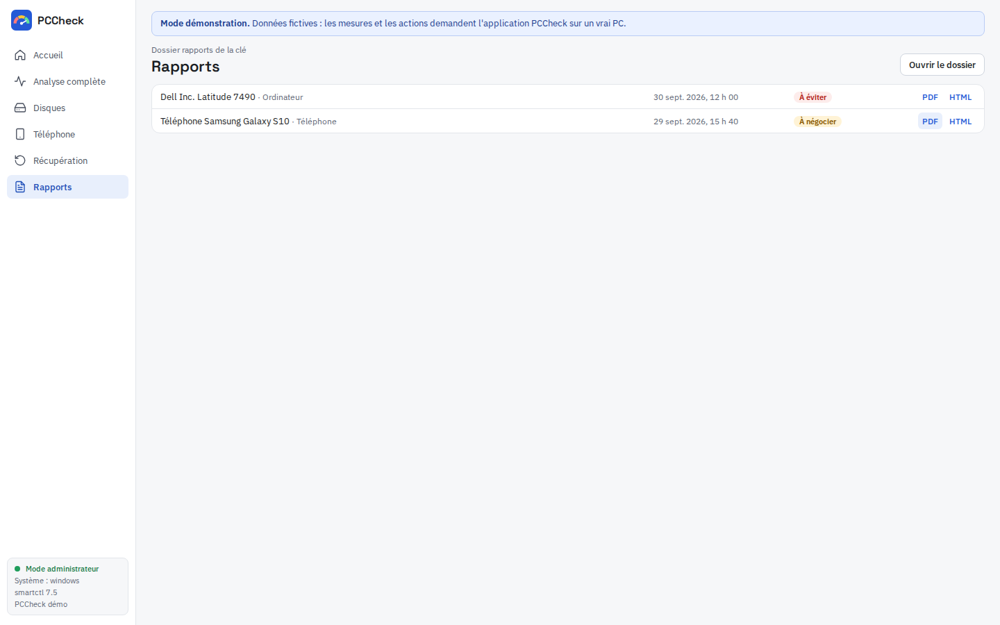

# Rapports et verdict

## Verdict

Chaque mesure reçoit un niveau : **Bon**, **À surveiller**, **Critique**, ou **Info** (descriptif, ne compte pas). Le verdict global :

- **À éviter** : au moins un point critique ;
- **À négocier** : au moins un point à surveiller ;
- **Bon achat** : tout est bon ;
- **Sans verdict** : aucune mesure évaluée.

Le résumé nomme les points en cause ; quand plusieurs disques ont le même point, le nom du disque est précisé.

## Repères principaux

| Mesure | Bon | À surveiller | Critique |
|---|---|---|---|
| Vie restante d'un SSD | ≥ 90 % | 70 – 89 % | < 70 % |
| Secteurs réalloués | 0 | 1 – 50 | > 50 |
| Secteurs en attente ou non corrigibles | 0 | — | > 0 |
| Température d'un disque | < 50 °C | 50 – 60 °C | > 60 °C |
| Santé de la batterie | ≥ 80 % | 60 – 79 % | < 60 % |
| Heures d'un disque dur | < 20 000 h | 20 000 – 40 000 h | > 40 000 h |
| Correctif de sécurité Android | < 3 mois | 3 – 12 mois | > 12 mois |

Vitesse des disques : voir [[Disques]].

## Fichiers

Chaque rapport est enregistré dans `rapports/` sur la clé, en trois fichiers de même nom :

- **PDF** : à imprimer ou envoyer ;
- **HTML** : autonome, s'ouvre dans n'importe quel navigateur sans Internet, avec tri, recherche et données brutes ;
- **JSON** : toutes les données, lisibles par un programme.

Le pied de page porte l'empreinte **SHA-256** du JSON : elle permet de vérifier que le rapport n'a pas été modifié.

L'écran **Rapports** liste les rapports de la clé, du plus récent au plus ancien.
